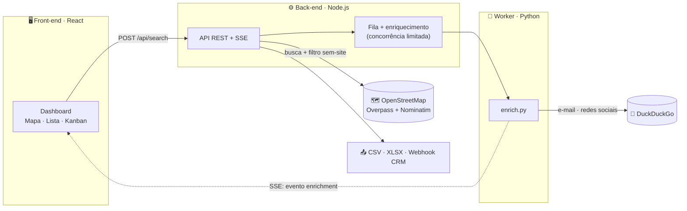

<div align="center">


# 🎯 Caça-Cliente

### O radar de negócios sem site — do clique ao WhatsApp.

*A ferramenta oficial do curso **Sites com IA do Zero** — encontre negócios **sem site** na sua cidade e feche seu primeiro cliente.*

[](https://nodejs.org)
[](https://python.org)
[](https://react.dev)
[](#-quanto-custa)
[](#-roadmap)

</div>

---

## 👋 O que é isso?

Você acabou de aprender a criar sites com IA. Agora precisa de **clientes** pra vender esses sites. Mas onde encontrar quem precisa de um site?

**A resposta é simples:** os negócios que **ainda não têm site**.

O problema é que achar esses negócios na mão é lento — você teria que abrir o Google, digitar "barbearia em [sua cidade]", clicar em cada um, ver se tem ou não site, anotar o telefone... O **Caça-Cliente** faz tudo isso pra você, **de graça**, em segundos:

1. Você digita o **nicho** (ex.: _barbearia_) e a **cidade**.
2. A ferramenta varre o **OpenStreetMap** (o "Google Maps" gratuito) e acha todos os estabelecimentos daquele ramo na região.
3. Ela **descarta automaticamente** os que já têm site — sobram só os que precisam de um.
4. Para cada lead, ela ainda **procura sozinha** o telefone, e-mail, Instagram, Facebook e LinkedIn na internet.
5. Você abre o WhatsApp com a mensagem já pronta, manda, e fecha o cliente.

> 💸 **100% gratuito, sem chaves de API, sem cartão de crédito.** Os dados vêm do **OpenStreetMap** e o enriquecimento do **DuckDuckGo** — ambos gratuitos e públicos.

---

## 🚀 Começando em 1 comando

**Pré-requisitos:** [Node.js 18+](https://nodejs.org) e [Python 3.10+](https://python.org/downloads) instalados.

```bash
git clone <repo-do-curso>.git
cd Caca-Cliente
npm run setup   # 1ª vez: instala tudo (raiz, server, web e o worker Python)
npm run dev     # sobe a ferramenta em http://localhost:5173
```

Abra **http://localhost:5173** no navegador. Pronto — a ferramenta está rodando.

> 💡 **Sem internet ou quer só testar?** Rode `npm run dev:mock` em vez de `npm run dev`. A ferramenta usa dados fictícios (negócios e contatos de mentira) pra você ver o fluxo funcionando sem depender de internet.

> 📺 **Nunca abriu um terminal antes?** Tem um passo a passo com prints em **[TUTORIAL.md](./TUTORIAL.md)** — começa por como abrir a pasta certa no VS Code.

---

## 🧭 Primeiro uso guiado — do clique ao primeiro cliente

### Passo 1 — Fazer uma busca

Na barra à esquerda:

1. **Nicho** — digite o tipo de negócio. Ex.: `barbearia`, `salão de estética`, `escritório de advocacia`, `restaurante`. Tem um dropdown com nichos prontos se você não souber o que digitar.
2. **Cidade** — comece a digitar e escolha uma opção da lista que aparece (autocomplete gratuito).
3. **Raio** — arraste a barrinha pra definir o tamanho da área (em km).
4. Clique em **Buscar leads sem site**.

Em segundos, os **pinos aparecem no mapa** e os cartões na lista à esquerda. Cada pino é um negócio **sem site** que você pode abordar.

### Passo 2 — Esperar os contatos chegarem (eles vêm sozinhos)

Você não precisa fazer nada. O sistema busca os contatos em segundo plano e eles **vão aparecendo nos cartões** conforme são encontrados (e-mail ✉️, Instagram 📷, Facebook, LinkedIn). Os pinos no mapa mudam de cor conforme isso acontece.

> Quer dar prioridade a um negócio específico? **Clique nele** — ele "fura a fila" e é processado na frente.

### Passo 3 — Filtrar e ordenar os leads

Acima da lista você pode:

- **Ordenar** por **Relevância (score)** ou por **Nome**.
- Ligar **filtros**: mostrar só quem tem 📞 WhatsApp, 📷 Instagram ou ✉️ E-mail.

Cada lead ganha uma nota de 0 a 100 (quanto mais fácil de contatar, maior):

- 🔴 **Quente** (60+) — tem vários contatos, vá com tudo.
- 🟡 **Morno** (35–59).
- 🔵 **Frio** (abaixo de 35).

### Passo 4 — Enriquecer o lead (opcional, mas recomendado)

Clique num cartão pra abrir os **detalhes** do lead. Lá você pode:

- Ver todos os contatos encontrados (e-mail, Instagram, Facebook, LinkedIn).
- Adicionar **anotações** (ex.: "liguei dia 12, pediu pra retornar quinta").
- Marcar **data de retorno** (follow-up) — o sistema te avisa quando vencer.
- Estimar o **valor** da venda.
- Adicionar **tags** (interessado, sem orçamento, pediu proposta, etc.).

### Passo 5 — Gerar a mensagem e abordar no WhatsApp

No cartão de um lead com telefone, clique em **💬 WhatsApp**. Abre uma conversa **com a mensagem já escrita** e personalizada conforme o ramo do negócio (barbearia recebe um gancho diferente de salão de estética, etc.). Você só revisa e aperta enviar.

> ✏️ **Quer editar a mensagem padrão?** Clique no botão **✏️ Mensagem do WhatsApp** (no topo). Você pode mudar o template, criar ganchos diferentes por nicho e definir um benefício padrão. A config fica salva no seu navegador.

> 🚀 **Modo disparo:** no Kanban, marque as caixinhas de até 10 leads e clique em **💬 Enviar no WhatsApp**. A ferramenta abre uma conversa por vez, em sequência — você só aperta enviar e o lead vai pra "Contatado" sozinho. (Limite de 10 pra não derrubar/bloquear seu número.)

### Passo 6 — Mover no Kanban até "Ganho"

No topo da barra, clique em **🗂 Kanban**. Aparece um quadro com colunas:

`Novo · Qualificado · Contatado · Ganho · Descartado`

**Arraste** os cartões de uma coluna pra outra conforme avança a negociação. Quando o cliente fechar, arraste pra **Ganho**. Pronto — você fechou seu primeiro cliente. 🎉

### Passo 7 — Exportar a lista (opcional)

Na barra à esquerda, em **Exportar**, baixe a planilha em **CSV** ou **Excel** com todos os leads e contatos — pronto pra usar em outro lugar ou no seu CRM.

---

## ❓ FAQ — erros e dúvidas comuns

### Instalação

**O comando `npm run setup` deu erro.**
- Confira se você tem o **Node.js 18+** instalado: rode `node --version` no terminal. Se aparecer um número menor que 18, baixe a versão LTS em [nodejs.org](https://nodejs.org).
- Confira se você tem o **Python 3.10+**: rode `py --version` (Windows) ou `python3 --version` (Mac/Linux). Se não aparecer nada, instale em [python.org](https://python.org/downloads) e marque **"Add Python to PATH"** na instalação (Windows).
- Se o erro for de permissão no Windows, tente abrir o terminal como administrador.

**O comando `npm run dev` não faz nada / abre e fecha.**
- Veja se aparece alguma mensagem de erro no terminal. Se aparecer "porta em uso" ou "port 5173 is in use", feche outros programas que possam estar usando essa porta (ou outro `npm run dev` que você deixou aberto).

### Uso

**Acessei http://localhost:5173 mas aparece "não foi possível acessar".**
- Confira se o terminal com `npm run dev` está aberto e mostrando as duas linhas `[api]` e `[web]`. Se o terminal fechou ou você reiniciou o PC, rode `npm run dev` de novo.

**Apareceu "Overpass ocupado" ao buscar.**
- É o serviço de mapas gratuito sob carga. Espere alguns segundos e tente de novo, ou reduza o raio da busca.

**Vieram poucos resultados.**
- Alguns nichos são mais bem mapeados no OpenStreetMap (restaurantes, beleza, clínicas, dentistas). Tente um raio maior ou uma cidade próxima.

**Os leads sumiram quando reiniciei o PC.**
- Sem banco de dados configurado, as buscas ficam só em memória (30 min). Pra salvar tudo, configure o PostgreSQL — veja **[docs/deploy-avancado.md](./docs/deploy-avancado.md)**.

**O WhatsApp não abre quando clico no botão.**
- Confira se o lead tem telefone (alguns negócios no OSM não têm). Se tem e mesmo assim não abre, confira se o seu navegador não está bloqueando pop-ups pra `wa.me`.

**A mensagem do WhatsApp veio com "[Seu nome]" no texto.**
- Esse é o template padrão de fábrica. Clique em **✏️ Editar mensagem do WhatsApp** no topo e coloque o seu nome no lugar de `[Seu nome]`. A config fica salva no seu navegador.

### Avançado

**Quero deixar a ferramenta 24/7 em casa (sem depender de terminal aberto).**
- Veja **[docs/deploy-avancado.md](./docs/deploy-avancado.md)** — tem o passo a passo de Docker + PostgreSQL + VPN privada.

**Quero compartilhar a ferramenta com meu sócio.**
- Mesmo link acima. Com a VPN privada configurada, você compartilha o acesso à máquina do seu home server com o email dele.

---

## 💸 Quanto custa?

**R$ 0.** A ferramenta é 100% gratuita:

- Dados de negócios: **OpenStreetMap** (gratuito, colaborativo).
- Geocoding (autocomplete de cidade): **Nominatim** (gratuito).
- Enriquecimento de contatos: **DuckDuckGo** (gratuito).
- Banco de dados: **PostgreSQL** (gratuito, opcional).
- VPN privada pra acesso remoto: **Tailscale** (gratuito até 100 dispositivos, opcional).

O único custo é a sua internet e, se você quiser deixar 24/7, um home server (qualquer PC velho ou Raspberry Pi serve).

---

## 🧱 Stack

| Camada | Tecnologia |
|---|---|
| **Front-end** | React + Vite + react-leaflet |
| **Back-end / API** | Node.js + Express (SSE) |
| **Worker de extração** | Python (httpx, asyncio) |
| **Dados de negócios** | OpenStreetMap — Overpass API |
| **Geocoding** | OpenStreetMap — Nominatim |
| **Enriquecimento** | DuckDuckGo (busca cruzada) |
| **Exportação** | exceljs (CSV / XLSX) |

---

## 🏗️ Arquitetura



**Fluxo em duas fases:** a busca (`POST /api/search`) é **síncrona e rápida** — devolve os negócios sem site e os pinos aparecem na hora. O enriquecimento roda **em segundo plano** e cada lead pronto é empurrado para a tela via **Server-Sent Events**, sem recarregar nada.

---

## ✨ Destaques

- 🗺️ **Mapa interativo** com pinos coloridos por status (Leaflet + tiles OpenStreetMap)
- 🔍 **Filtro "sem site" nativo** — descarta automaticamente quem já tem site
- 🧩 **Enriquecimento sob demanda** — e-mail, Instagram, Facebook e LinkedIn via busca cruzada
- ⚡ **Tempo real (SSE)** — os contatos pingam na tela conforme são encontrados, sem travar
- 🗂️ **Funil Kanban** — arraste leads entre `Novo · Qualificado · Contatado · Ganho · Descartado`
- 🏙️ **Autocomplete de cidade** com geocoding gratuito (Nominatim)
- 📤 **Exportação CSV / Excel** + **webhook** para integrar com seu CRM
- 🗄️ **Persistência opcional** em PostgreSQL (roda em memória por padrão; ativa com `DATABASE_URL`)

---

## 📚 Documentação

- **[TUTORIAL.md](./TUTORIAL.md)** — passo a passo com prints pra quem nunca abriu um terminal.
- **[docs/deploy-avancado.md](./docs/deploy-avancado.md)** — como deixar a ferramenta 24/7 em casa (Docker + PostgreSQL + VPN).
- **[docs/rebrand-propostas.md](./docs/rebrand-propostas.md)** — propostas de novo nome e identidade visual (em decisão).

---

## 🗺️ Roadmap

- [x] Busca de negócios sem site (Overpass) + filtro
- [x] Enriquecimento de contatos (Python + DuckDuckGo)
- [x] Tempo real via SSE + mapa Leaflet
- [x] Autocomplete de cidade (Nominatim)
- [x] Exportação CSV / Excel + webhook
- [x] Funil Kanban (drag-and-drop)
- [x] Persistência em PostgreSQL (buscas, leads, enriquecimento e estágios)
- [ ] Autenticação e multi-tenant
- [ ] Fila distribuída (BullMQ/Redis) para múltiplos workers
- [ ] Proxies rotativos para enriquecimento em escala

---

## 📌 Observações

- Projeto em estágio **MVP**. Sem `DATABASE_URL`, as sessões ficam em memória e somem ao reiniciar; com Postgres configurado, buscas/leads/estágios são persistidos (a fila e o stream SSE seguem em memória, por serem estado de runtime).
- Tiles do OSM são gratuitos mas têm política de uso justo; em produção use um provedor de tiles (MapTiler) ou self-host.
- Coleta de contatos para prospecção: registre a origem do dado (campo `source`), ofereça _opt-out_ e trate apenas o necessário (**LGPD**).

---

## 🎓 Créditos

<div align="center">


### O Caça-Cliente é a ferramenta oficial do curso **[Sites com IA do Zero](https://instagram.com/devjuninho_)**.

Siga o **DevJuninho** nas redes e fique por dentro do curso:

[](https://instagram.com/devjuninho_)
[](https://x.com/devjuninho)

</div>

---

<div align="center">
<sub>Ferramenta oficial do curso <strong>Sites com IA do Zero</strong> · feita com ☕ e dados abertos do OpenStreetMap · contribuições ODbL</sub>
</div>
